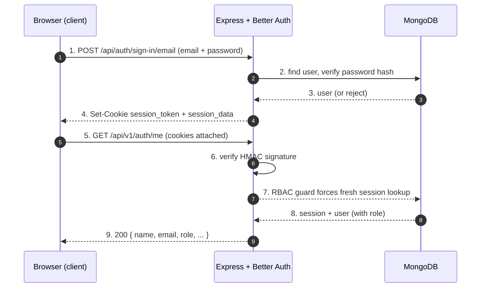
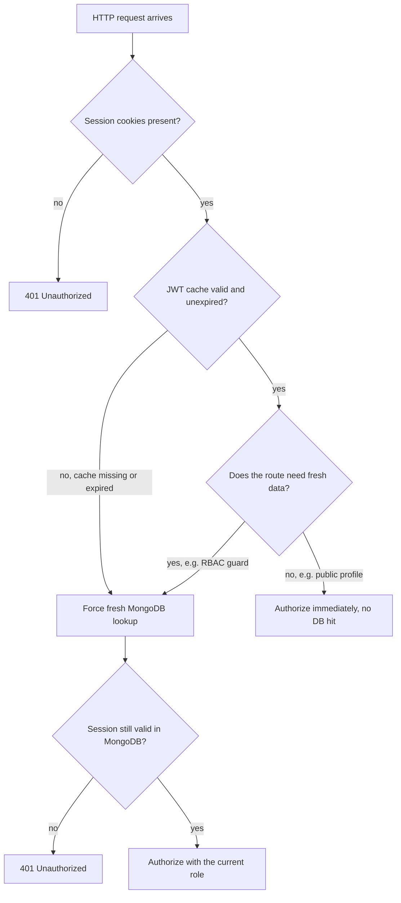
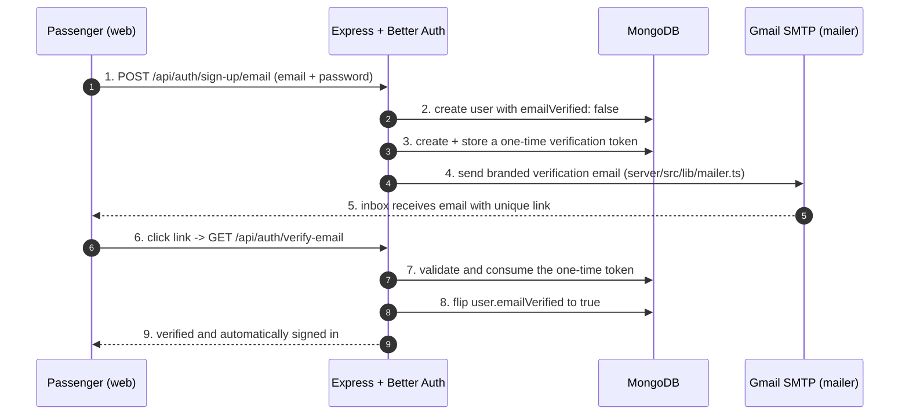
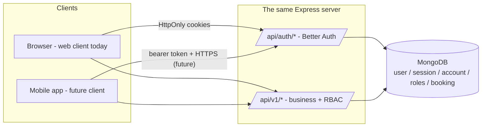
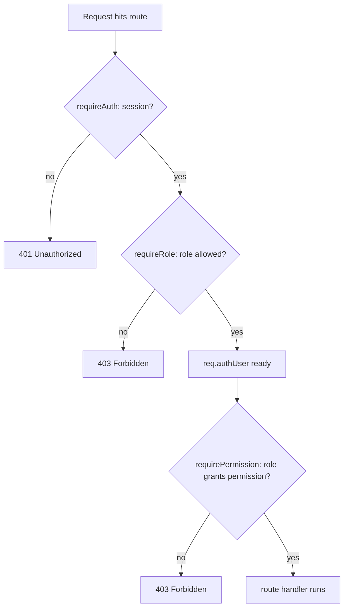
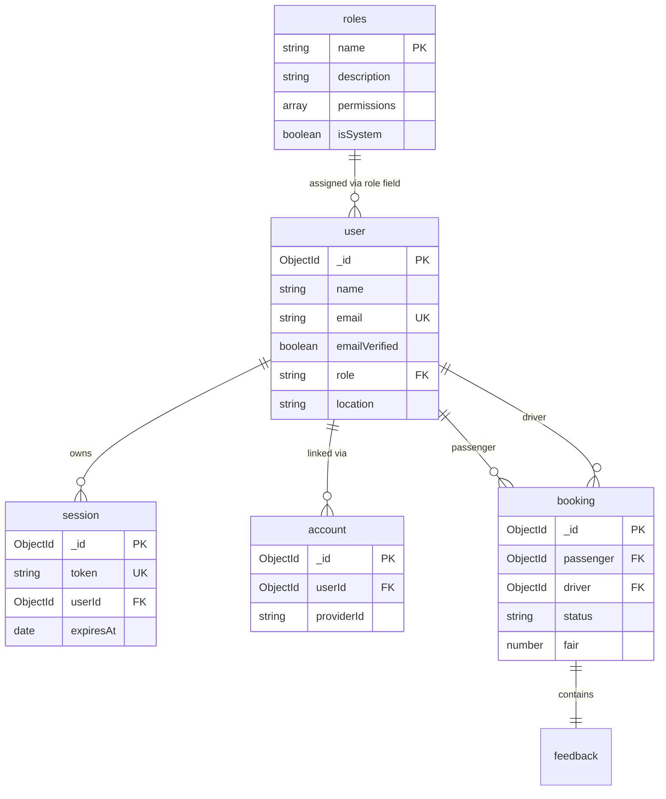
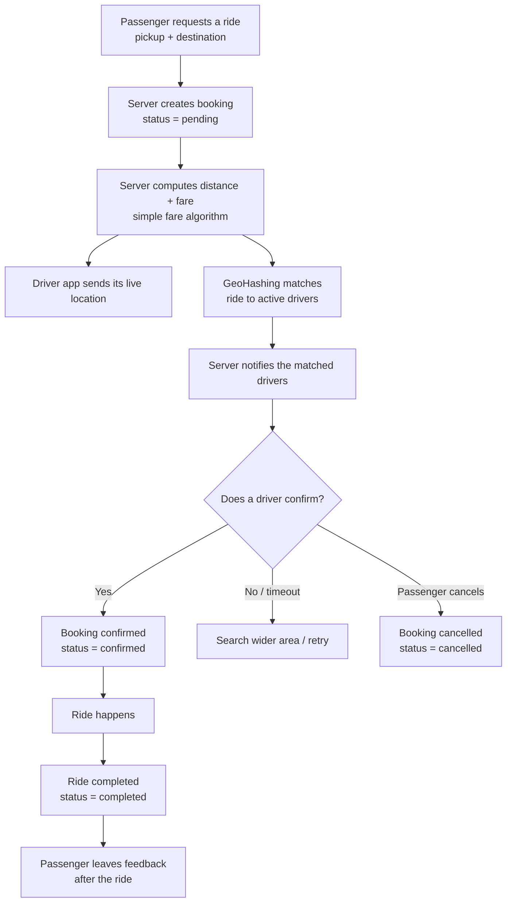
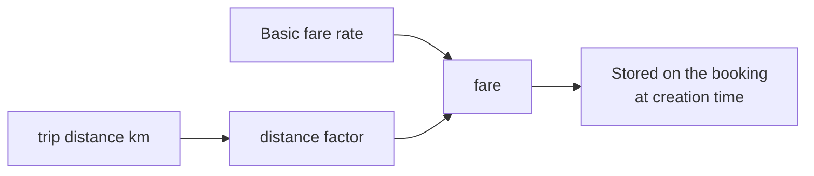
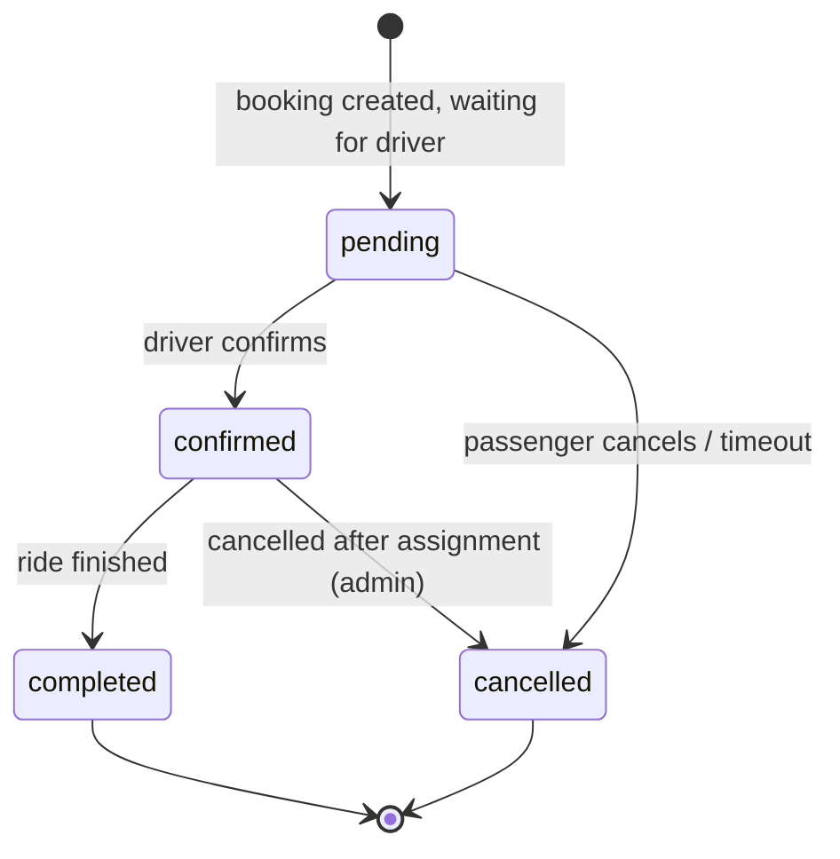

# Drio - Premium Ride Booking Application


Welcome to the Drio ride booking application. This is a full-stack web app built with a React frontend, an Express + TypeScript backend, and MongoDB as the database. The project lives in this repository as two separate applications:

- `client/` - the React web app users see in the browser.
- `server/` - the Express API that powers authentication, roles, and future business logic.

This README explains, in plain language, what the project does, how it is put together, and -- most importantly -- the *why* behind every major decision that was made while building it.

---

## Table of Contents

1. [What is Drio?](#what-is-drio)
2. [Tech Stack](#tech-stack)
3. [Repository Layout](#repository-layout)
4. [How to Set Up and Run](#how-to-set-up-and-run)
5. [Environment Variables](#environment-variables)
6. [How Authentication Works](#how-authentication-works)
7. [How Roles and Permissions Work (RBAC)](#how-roles-and-permissions-work-rbac)
8. [The Data Model](#the-data-model)
9. [The Mongoose Models and the "Same Collection" Question](#the-mongoose-models-and-the-same-collection-question)
10. [Booking Architecture and the Flow](#booking-architecture-and-the-flow)
11. [API Endpoints](#api-endpoints)
12. [What Was Built and Why (Build Log)](#what-was-built-and-why-build-log)
13. [Things We Verified](#things-we-verified)
14. [Important Git Note Before You Push](#important-git-note-before-you-push)
15. [Security Notes](#security-notes)
16. [What Comes Next](#what-comes-next)

---

## What is Drio?

Drio is a ride-booking service in the style of premium ride-hailing apps. Users can:

- Create an account (with email and password, or with Google Sign-In).
- Receive a verification email to confirm their identity.
- Sign in and stay signed in securely.
- See a polished booking dashboard with a home screen (book a ride), a ride history screen, and an account screen.

The application is being built step by step. The current milestone added a complete **role-based access control (RBAC)** system on the server so different people

- passengers,
- drivers, and
- administrators

can later get different capabilities (booking, accepting rides, managing users, and so on).

---

## Tech Stack

### Client (`client/`)

- **React 19** with **TypeScript** - the user interface.
- **Vite 8** - fast development server and build tool.
- **Tailwind CSS 4** - styling.
- **shadcn/ui** + **Base UI** components - buttons, inputs, cards, avatars, etc.
- **React Router 7** - page navigation (`/login`, `/register`, `/dashboard`).
- **lucide-react** - icons.
- **better-auth/react** - the official client SDK for Better Auth.

### Server (`server/`)

- **Node.js + Express 5** - the API framework.
- **TypeScript** - type safety across the backend.
- **Better Auth 1.7** - the authentication library (handles sessions, cookies, OAuth, the admin plugin).
- **MongoDB** (official `mongodb` driver) - where Better Auth stores users, sessions, and accounts.
- **Mongoose 9** - an additional "modeling" layer we added for our own business entities (roles, users with geo-location, future bookings).
- **nodemailer** - sends the verification emails through Gmail SMTP.
- **winston** - structured logging.
- **nodemon / ts-node** - running the TypeScript server in development.

### Database

- MongoDB Atlas cluster, database name **Drio**.

---

## Repository Layout

```
Drio/
├── client/                  # React + Vite frontend
│   ├── src/
│   │   ├── components/      # Reusable UI (AuthLayout, Logo, ui/*)
│   │   ├── pages/           # Login, Register, Dashboard
│   │   ├── lib/
│   │   │   ├── auth-client.ts   # Better Auth client configuration
│   │   │   └── utils.ts
│   │   ├── App.tsx          # Route definitions
│   │   ├── main.tsx
│   │   └── index.css        # Global theme (dark premium design)
│   ├── index.html
│   ├── package.json
│   ├── vite.config.ts
│   └── .env                 # VITE_BETTER_AUTH_URL (NOT committed)
│
└── server/                  # Express + TypeScript backend
    └── src/
        ├── server.ts              # App entry point: Express + MongoDB + mongoose + seed
        ├── config/                # auth.config, db.config, logger.config
        ├── lib/
        │   ├── auth.ts            # Better Auth setup (the heart of auth)
        │   ├── rbac.ts            # Role/permission definitions
        │   ├── rbac.seed.ts       # Seeds roles into MongoDB + backfills users
        │   ├── mongoose.ts        # Mongoose connection
        │   └── mailer.ts          # nodemailer (verification emails)
        ├── middlewares/
        │   ├── rbac.middleware.ts # requireAuth / requireRole / requirePermission
        │   └── error.middleware.ts
        ├── models/                # Mongoose models
        │   ├── user.model.ts      # Map over the `user` collection (additive)
        │   ├── role.model.ts      # The `roles` collection (permission matrix)
        │   ├── booking.model.ts   # (empty - next step)
        │   └── index.ts
        └── routers/
            ├── v1/
            │   ├── auth.router.ts        # GET /api/v1/auth/me
            │   ├── passenger.router.ts   # profile + guarded bookings routes
            │   ├── driver.router.ts      # profile + guarded rides routes
            │   ├── ping.router.ts
            │   └── index.router.ts
            └── v2/ (placeholder)
```

---

## How to Set Up and Run

### Requirements

- Node.js 18 or newer.
- A MongoDB Atlas URI.
- (For sending emails) a Gmail account with an App Password.

### 1. Install dependencies

Open two terminals, one for the server and one for the client.

```bash
cd server
npm install
```

```bash
cd client
npm install
```

### 2. Configure environment variables

Both applications read configuration from `.env` files. **Never commit these files** - they contain secrets. See [Environment Variables](#environment-variables) below for the full list.

### 3. Run the server

```bash
cd server
npm run dev
```

The API runs on `http://localhost:3000`. On startup the server:

1. Connects to MongoDB (Better Auth driver).
2. Connects with Mongoose.
3. Seeds the three roles (passenger, driver, admin) into the `roles` collection.
4. Backfills any existing users so everyone has a role (default: passenger), promotes the configured admin email to `admin`, and demotes anyone else who is `admin` back to `passenger`.

### 4. Run the client

```bash
cd client
npm run dev
```

The web app runs on the Vite URL printed in the terminal (usually `http://localhost:5173`). Open it, register or sign in, and you should land on the booking dashboard.

---

## Environment Variables

### `server/.env`

| Variable | Purpose | Example |
| --- | --- | --- |
| `PORT` | Port the Express server listens on | `3000` |
| `MONGO_URI` | MongoDB connection string. Better Auth stores users/sessions/accounts here; Mongoose reads the same database. | `mongodb+srv://<user>:<pass>@<cluster>.mongodb.net/Drio` |
| `BETTER_AUTH_SECRET` | Secret used to sign session cookies and JWT session cache. **Must be at least 32 characters.** | a random long string |
| `BETTER_AUTH_URL` | Public URL of the auth/server | `http://localhost:3000` |
| `GOOGLE_CLIENT_ID` | Google OAuth client id | ...apps.googleusercontent.com |
| `GOOGLE_CLIENT_SECRET` | Google OAuth client secret | ... |
| `MAIL_ID` | Gmail address used to send verification emails | `you@gmail.com` |
| `MAIL_PASSWORD` | Gmail App Password (not your normal password) | ... |
| `DRIO_ADMIN_EMAILS` | Optional. Comma-separated emails that get the `admin` role. **Default: `mustafamubashir87@gmail.com`** | `admin@drio.com` |
| `TRUSTED_ORIGINS` | Optional. Extra allowed browser origins. Defaults to any localhost. | - |

### `client/.env`

| Variable | Purpose | Example |
| --- | --- | --- |
| `VITE_BETTER_AUTH_URL` | Base URL of the server, used by the Better Auth client | `http://localhost:3000` |

---

## How Authentication Works

Authentication is provided entirely by **Better Auth**, which runs inside the Express server and is mounted on the `/api/auth/*` path (see `server/src/server.ts` and `server/src/lib/auth.ts`).

### What Better Auth gives us

1. **Email + password sign-up** with:
   - a minimum password length of 8,
   - **email verification required** before the account can be used (`requireEmailVerification: true`),
   - an automatic verification email with a fancy branded button (`server/src/lib/mailer.ts`),
   - automatic sign-in after the user clicks the verification link.
2. **Google OAuth sign-in** (Google button on the login/register pages).
3. **Sessions** stored in the MongoDB `session` collection.
4. **Cookies**:
   - `better-auth.session_token` - a random opaque token identifying the session. It is signed so it cannot be tampered with. Its format is `token.signature`, where the signature is an HMAC-SHA256 of the token using `BETTER_AUTH_SECRET`.
   - `better-auth.session_data` - a JSON Web Token (JWT) that caches the session data. This is our **session cookie cache**.
5. **The admin plugin**, which is what makes RBAC possible (see below).

### The session cookie cache (an important design decision)

By default Better Auth would hit the database on every single request to check the session. That is slow. Instead we enabled:

```ts
session: {
  cookieCache: {
    enabled: true,
    maxAge: 60 * 5,      // 5 minutes
    strategy: "jwt",     // cache the session in a signed JWT cookie
  },
},
```

Why a JWT instead of a database hit for every request? Because the JWT cookie lets the server confirm "who is this user?" instantly, without asking MongoDB, for up to 5 minutes. When the JWT expires, Better Auth refreshes it.

But there is a trade-off: the JWT cache could be stale for up to 5 minutes. That is why our **RBAC guards explicitly disable the cookie cache** and force a real database lookup (see `middlewares/rbac.middleware.ts`). This way, when an admin changes someone's role, the new role takes effect immediately instead of waiting for the cache to expire.

### Why authentication is built the way it is (the deep dive)

This subsection exists to answer the question "why all this complexity?" The short answer: every choice here is about *reducing the damage if one part of the system is compromised*, not about being fancy.

1. **Why an auth library and not hand-written auth?** Better Auth is a battle-tested implementation. It handles the parts that are easy to get wrong: strong password hashing (passwords are never stored or logged in plain text), timing-safe comparisons, CSRF protection, secure cookie flags, and session lifecycle. Writing this by hand is a security project in itself. By using a library we only *configure* well-tested defaults instead of re-inventing them.

2. **Why database-backed sessions instead of long-lived JWTs?** Because a session stored in MongoDB can be **revoked instantly**. Sign out, ban a user, or change their role and the `session` document is gone/changed immediately. A pure stateless JWT that lives only in the browser cannot be invalidated until it expires, which is a bad fit for an app that has roles and bans. That is why the token is opaque (`<random>.<signature>`) and the real session state lives in the DB.

3. **Why the `token.signature` cookie format (HMAC-SHA256)?** The random `token` is the real secret; the `signature` is an HMAC computed over it with `BETTER_AUTH_SECRET`. If a user tampers with the cookie in any way, the signature no longer verifies. This is what makes "opaque random token" usable as a browser cookie: the server trusts it only because it can prove it was signed by us.

4. **Why two cookies (`session_token` + `session_data`)?** They have different jobs:
   - `session_token` - the source of truth; checked against MongoDB.
   - `session_data` - a signed JWT that *caches* who the user is, so ordinary requests can skip the database (the cookie cache explained above).
   Keeping them separate means we can roll out a faster path without making the secure path optional.

5. **Why HttpOnly + SameSite + restricted CORS?** The session cookies are HttpOnly, so JavaScript running in the browser cannot read them - an XSS attack cannot steal the session. SameSite/Lax plus CORS limited to localhost (and anything in `TRUSTED_ORIGINS`) is the defense against cross-site request forgery and cross-origin abuse.

6. **Why is email verification required?** It proves the inbox belongs to the person claiming it. That prevents burner/spam accounts (an unverifiable address cannot be used until it is confirmed) and keeps the marketplace trustworthy - which matters once drivers and real bookings exist.

7. **Why Google OAuth as well?** Google already verified the email, so those accounts need no extra email step; users skip remembering another password; and onboarding is faster. The `account` collection stores these provider-linked logins.

8. **Why a 32+ character secret?** Signature entropy. `BETTER_AUTH_SECRET` signs every cookie and the session cache JWT. If it changes, every cookie becomes invalid and everyone must sign in again - which is the documented, expected behavior, not a bug.

**The verification flow on one request:**



### JWT-only vs session-only vs the hybrid: why we picked the hybrid

A ride-booking marketplace needs three things from auth at the same time: **instant revocation** (ban a bad driver now, not in 30 minutes), **low latency** (every request should feel instant), and **multi-server friendliness** (the app grows past one process). The classic one-trick approaches each sacrifice one of those:

| Concern | JWT-only (stateless) | Session-only (DB row every request) | Hybrid (ours) |
| --- | --- | --- | --- |
| What the client holds | One signed JWT | An opaque cookie pointing at a DB row | Opaque `session_token` + a JWT *cache* cookie |
| Logout / ban takes effect | Only when the JWT expires | Instantly (delete the row) | Instantly for the DB session; the cache catches up in <= 5 min |
| Role change applies | On JWT expiry | Immediately | Immediately on RBAC-guarded routes (they force the DB) |
| Cost per request | None (verify signature only) | One DB read per request | DB read only when the cache is missing/expired or a guard demands freshness |
| Works across many servers | Yes, purely stateless | Needs shared Mongo (fine - we have one) | Needs shared Mongo + shared secret |
| Stolen token is usable | Until it expires, everywhere | Until you revoke it | Until you revoke the DB session (the cache is re-validated) |
| Freshness vs speed | Fast, but never fresh | Always fresh, but slow | Fresh where it matters, fast everywhere else |

The key insight: **our JWT is not the identity - it is only a signed cache of the identity.** The real session is the opaque `session_token` row in MongoDB. So we get the JWT world's speed for ordinary requests while keeping the session-only world's ability to revoke instantly. The route guards decide which world each request lives in:



That is exactly why `requireAuth`, `requireRole`, and `requirePermission` disable the cookie cache and hit MongoDB - the one place where a 5-minute-old role or a missed ban would be unacceptable. `GET /api/v1/auth/me` is a fast-paced, freshness-tolerant read, so it works off the cached identity in most cases.

### Email verification, end to end

Why do we demand a verified email *before* the account can be used? Three practical reasons for a marketplace app:

1. **It proves the email belongs to the person claiming it** - accounts are no longer throwaways created with a typo or a borrowed address.
2. **It blocks spam and abuse** - `requireEmailVerification: true` means an unverified account cannot actually log in, so bots cannot spin up thousands of "ready-to-use" accounts in seconds.
3. **It makes future features trustworthy** - password resets, driver onboarding, and dispute emails only work if the inbox is real. Every serious competitor in ride booking requires it.

The flow, once a user submits the sign-up form:



Notes that matter in practice:

- **The token is one-time and expires.** Reused or stale links fail validation - this prevents link replay.
- **Between step 1 and step 9 the account exists but is locked.** Better Auth refuses sign-in for that email until it is verified, so an unverified account can never book a ride or hold a driver role.
- **Google OAuth skips the email step.** Google already verified the address, so those users arrive with `emailVerified: true` from the start (the `account` collection links the provider login).
- **Nothing sensitive is sent in the email** - the link configures Better Auth to auto-sign-in after verification for a smooth onboarding.

### Future: the same auth on a mobile client (hints, not plans)

This document stays web-focused, but nothing in the server was built "web only". Auth lives at `/api/auth/*` and business logic at `/api/v1/*` - both are client-agnostic, so a mobile app later reuses the exact same account, session, role, and booking system. Only the *transport* differs:

- **Web today** - the browser quietly manages the HttpOnly + SameSite cookies for us; JavaScript never sees the session token.
- **Mobile later** - a native app has no browser cookie jar. Options: return the `session_token` to the app and store it in iOS Keychain / Android Keystore, send it as a bearer header on each request; or run the login in a WebView that keeps its own cookies; or use an OAuth/PKCE-style flow for Google sign-in. All mobile requests must go over HTTPS.
- **Why this "just works" later** - because identity is a revocable DB session, not a cookie mechanism, we can add a custom token transport for mobile without redesigning sessions, roles, bans, or the RBAC guards. Logging a user out on all devices, or banning a driver, stays instant no matter which client they used.



### How the client talks to the server

- `client/src/lib/auth-client.ts` creates the Better Auth client pointed at the server URL.
- `client/src/App.tsx` defines the routes.
- `ProtectedRoute` redirects unauthenticated users to `/login`.
- `PublicOnlyRoute` redirects already-authenticated users away from `/login` and `/register`.
- The dashboard (`pages/Dashboard.tsx`) is a polished dark, premium-themed booking UI (sidebar, book-a-ride panel, mock map, ride history, account tab). It is currently UI-only; the booking logic wires in next.

---

## How Roles and Permissions Work (RBAC)

RBAC stands for **Role-Based Access Control**: "what you are allowed to do depends on the role you have."

### The two pieces of the design

1. **The role is stored on the user themselves.** Every user in the `user` collection has a `role` field with one of three values:
   - `passenger` (the default - assigned to everyone when they sign up or get backfilled),
   - `driver`,
   - `admin`.

2. **The permissions of each role live in a separate `roles` collection.** Each role document contains an array of permissions in the form `resource:action`, for example `booking:create` means "can create a booking" and `user:set-role` means "can change someone's role".

### Why this split?

- Putting just the *role name* on the user is simple and fast (one field, easy to index, easy to show on the profile).
- Keeping the *permission matrix* in the `roles` collection means we can change what a role can do later without touching every user. If we decide "drivers may now cancel bookings too", we update one row in `roles` and every driver automatically gets the new ability.

### The statements that exist right now

Defined in `server/src/lib/rbac.ts` using Better Auth's `createAccessControl`:

- `user`: create, list, get, update, delete, set-role
- `session`: list, revoke
- `booking`: create, read, list, update, cancel

The three roles and what they may do:

| Role | Permissions |
| --- | --- |
| `passenger` | `user:get`, `session:list`, `session:revoke`, `booking:create`, `booking:read`, `booking:list`, `booking:cancel` |
| `driver` | `user:get`, `session:list`, `session:revoke`, `booking:read`, `booking:list` (cannot create bookings) |
| `admin` | everything, including all `user:*` and `booking:update` |

### Why exactly these three roles?

Ride booking has exactly three kinds of people, and each role mirrors one of them:

- **`passenger`** - the person who requests a ride. Their needs are: create a booking, see its status, look at their history, and cancel. That is precisely `booking:create/read/list/cancel` plus reading their own profile and sessions. Notice they *cannot* update a booking - the passenger can request and cancel, but the lifecycle moves forward through the driver/admin.
- **`driver`** - the person who fulfills the ride. They need to *see* available bookings (`booking:read/list`), but intentionally **cannot create** bookings. A driver "creating a booking" makes no business sense (that is the passenger's job) and would let a driver fabricate fake ride entries. They also do not cancel - cancellation of an assigned ride is an admin/update-level action for now.
- **`admin`** - platform operator. Needs the full set: manage users (including changing roles via `user:set-role`), manage sessions (`session:list/revoke`), and update bookings (`booking:update`) to resolve disputes.

The domain is reflected in the permission strings themselves: `user`, `session`, and `booking` are the three real entities in the system, and the roles only get the slices of those entities their job actually needs.

**How the guards decide (flow):**



These same definitions are:

1. handed to the Better Auth admin plugin (`admin({ defaultRole, adminRoles, ac: accessControl, roles: defaultRoles })`), so Better Auth *itself* knows about roles, and
2. used by our own Express guards.

### The guards (middleware)

`server/src/middlewares/rbac.middleware.ts` exposes three Express middlewares:

- `requireAuth` - resolves the session from the request cookies (with cookie cache disabled for freshness) and attaches `req.authUser`. Without a valid session it returns **401 Unauthorized**.
- `requireRole(...)` - checks `req.authUser.role` is one of the given roles, e.g. `requireRole('driver', 'admin')`. Failure returns **403 Forbidden**.
- `requirePermission(...)` - looks the user's role up in the `roles` collection and checks the role actually grants every requested permission, e.g. `requirePermission('booking:create')`. Failure returns **403 Forbidden**.

### How they protect routes

- `GET /api/v1/auth/me` -> `requireAuth`
- `GET /api/v1/passenger/profile` -> `requireAuth`
- `GET /api/v1/passenger/bookings` -> `requireRole('passenger','driver','admin')` + `requirePermission('booking:list')`
- `POST /api/v1/passenger/bookings` -> `requireRole('passenger')` + `requirePermission('booking:create')`
- `GET /api/v1/driver/rides` -> `requireRole('driver','admin')` + `requirePermission('booking:list')`

### Seeding and backfilling (`server/src/lib/rbac.seed.ts`)

Because the application already had users *before* roles existed, the seed script does three things on every server start:

1. **Seeds roles**: upserts the `passenger`/`driver`/`admin` documents into the `roles` collection with their permission arrays.
2. **Backfills roles**: any user missing a `role` field gets `passenger`.
3. **Enforces the admin list**: users listed in `DRIO_ADMIN_EMAILS` (default: `mustafamubashir87@gmail.com`) are set to `admin`, and **any other user who currently has `admin` is demoted back to `passenger`**. This guarantees the configured email is the only admin.

This makes the process idempotent and predictable - running the server multiple times never bloats or corrupts the data.

---

## The Data Model

MongoDB collections used by the app:

| Collection | Who writes it | Purpose | Key fields |
| --- | --- | --- | --- |
| `user` | Better Auth | One document per user account | `_id`, `name`, `email`, `emailVerified`, `image`, `createdAt`, `updatedAt`, plus admin-plugin fields: `role`, `banned`, `banReason`, `banExpires`, and our new `location` |
| `session` | Better Auth | Login sessions | `_id`, `token`, `userId`, `expiresAt`, `createdAt`, `updatedAt`, `ipAddress`, `userAgent` |
| `account` | Better Auth | OAuth / provider accounts (e.g. Google) | `_id`, `userId`, `providerId`, `accountId`, ... |
| `verification` | Better Auth | Email verification tokens | (created automatically when needed) |
| `roles` | Mongoose (seed) | The permission matrix per role | `name`, `description`, `permissions[]`, `isSystem` |

### The models in detail (field by field)

**`user` (mongoose `user.model.ts`)** - one document per person. Fields Better Auth writes:

| Field | Type | Meaning |
| --- | --- | --- |
| `_id` | ObjectId | Primary key |
| `name` | string | Display name |
| `email` | string | Unique login email |
| `emailVerified` | boolean | Whether the verification link was clicked |
| `image` | string | Avatar URL (Google or default) |
| `createdAt` / `updatedAt` | Date | Timestamps |
| `role` | `passenger` \| `driver` \| `admin` | Default `passenger`, set by admin plugin |
| `banned` / `banReason` / `banExpires` | mixed | Admin-plugin ban controls |
| `location` | GeoJSON Point | Our add-on: `{ type: "Point", coordinates: [lng, lat] }` |

**`session`** - one document per active login. Fields: `_id`, `token` (the random opaque token), `userId` (link back to `user`), `expiresAt`, `createdAt`, `updatedAt`, `ipAddress`, `userAgent`. Deleting a session document = signing that user out instantly.

**`account`** - provider logins. Fields: `_id`, `userId`, `providerId` (e.g. `google`), `accountId`. An email/password user has no `account` rows; a Google user gets one.

**`verification`** - transient email-verification tokens, created on demand and consumed when the link is clicked.

**`roles`** - the permission matrix. One document per role: `name` (unique), `description`, `permissions[]` (the `resource:action` strings), `isSystem` (whether it must not be deleted). Seeded by `rbac.seed.ts`.

**`booking`** - (being built) the ride itself. Planned fields: `passenger` (ref `user`), `driver` (ref `user`, null until accepted), `source` / `destination` (`{ latitude, longitude }`), `fair` (fare amount), `distance`, `status` (`pending` \| `confirmed` \| `cancelled` \| `completed`), `feedback` (`{ rating, comment }`), timestamps.

**How the collections relate** - the `user` is the hub: it has a role (from `roles`), holds sessions (from `session`), links providers (from `account`), and will drive bookings as either `passenger` or `driver`:



> `booking` exists only in the readme/model plan right now; the collection appears in MongoDB as soon as the first booking service call creates a document.

---

## The Mongoose Models and the "Same Collection" Question

You asked a very good question: *"Is the current user model the same as the existing user model, or will it overlap? Does it only add a field?"*

Here is the exact answer.

### It is the SAME MongoDB collection, seen through a second lens

- Better Auth talks to the database directly with the official Mongo driver. It stores users in a collection named `user`.
- Our Mongoose model is compiled with `collection: "user"` (see `server/src/models/user.model.ts`). Mongoose is NOT creating a second collection. It is just another way to read and write from that exact same `user` collection.

So there is **one** `user` collection in MongoDB, and two pieces of code that touch it:
1. Better Auth (for auth),
2. Mongoose (for us, when we need to do things like seed roles, run geo queries, or later build features).

### Does it overlap / conflict? No - it is additive.

- The Mongoose schema declares the fields Better Auth produces (`name`, `email`, `emailVerified`, `image`, `createdAt`, `updatedAt`) plus the admin-plugin fields (`role`, `banned`, `banReason`, `banExpires`).
- Because the schema sets `strict: false`, Mongoose will **never strip or remove** fields it does not know about. Any field Better Auth writes that is not in our schema will still be stored and preserved.
- Adding a NEW field to the Mongoose schema only *tells Mongoose about that field*. It does not delete, rename, or re-type anything Better Auth already uses.

### The `location` field (what we just added)

We added a proper GeoJSON `location` field to the user model:

```ts
location: {
  type: {
    type: String,
    enum: ["Point"],   // GeoJSON type - always "Point"
    default: "Point",
  },
  coordinates: {
    type: [Number],    // [longitude, latitude]
    default: [0, 0],
  },
}
```

- As a GeoJSON Point with `[longitude, latitude]` coordinates, this is exactly what MongoDB expects for geospatial queries.
- A `2dsphere` index is created via `userSchema.index({ location: "2dsphere" })`. This is what makes "find users near me", "nearest driver", and similar geo queries fast later.
- Defaults mean a new user document created through Mongoose automatically gets `{ type: "Point", coordinates: [0, 0] }`. **Existing documents will not be rewritten** - they simply have no `location` until something sets it (which is fine; the index simply ignores documents without the field).

### One important boundary

Mongoose defaults (like `location`, or `role: "passenger"`) only apply when a document is created **through Mongoose**. Users created **through Better Auth at signup** are inserted by Better Auth itself, so they will not automatically receive a `location` field. The `role` defaults is handled separately for those users by Better Auth's admin plugin (`defaultRole: "passenger"`). That separation is intentional and safe.

---

## Booking Architecture and the Flow

This section documents the decided architecture for how a ride gets booked, matched, and completed. It is the plan we agreed on, and the `booking` work in `routers/v1/passenger.router.ts` + `models/booking.model.ts` implements step one of it.

### The decided end-to-end flow

A booking goes through clear stages, and a driver always confirms before the ride is "real":



1. **Create the booking + calculate the fare on demand** - the passenger calls `POST /api/v1/passenger/bookings` with source and destination. The server creates the booking in `pending` state, immediately computes the trip distance and the fare, and stores both on the order.
2. **Wait for the driver's response** - the booking now exists but no driver is attached. It waits in `pending` until a driver confirms it.
3. **GeoHashing matches the ride to drivers** - drivers continuously send their live `(latitude, longitude)` location. When a booking is created, a GeoHashing algorithm decides which drivers are near enough to be offered the ride. (More below.)
4. **Notify the matched drivers** - only the matched/active drivers get a notification that a new ride is near them. No broadcast to everyone, no spam.
5. **Driver confirms -> ride confirmed** - the first driver to confirm becomes the assigned `driver`, and the booking moves to `confirmed`. This is the "wait for the driver's response" step the client shows as a spinner.
6. **Feedback after the ride** - once the trip is `completed`, the passenger can submit a rating and comment, which is stored in the booking's `feedback` field. (Feedback is only possible on a completed ride.)

### The fare is deliberately simple (for now)

We deliberately keep the fare algorithm trivial at first so the matching and booking pipeline can be proven end to end; pricing sophistication comes later:



- **Basic fare** - a fixed per-ride base charge.
- **Per-kilometer rate** - multiplied by the trip distance.
- **Distance** - currently computed with the **Haversine formula** (`server/src/utils/helpers/distance.ts`): distance over a sphere from the pickup's latitude/longitude to the destination's. Good enough for pricing estimates; a real turn-by-turn route distance can be swapped in later without changing the booking flow.

### Matching drivers with GeoHashing

The decided matching approach is **GeoHashing** (geohash):

```mermaid
flowchart TB
    subgraph Drivers
        D1[Driver A sends location] --> E1[geohash(lat, long)\n-> short string cell]
        D2[Driver B sends location] --> E2[geohash(lat, long)\n-> short string cell]
    end
    subgraph Booking side
        P[Passenger pickup point] --> F[geohash(pickup)\n-> same precision cell]
        F --> G[Compare ride cell vs driver cells\n+ neighbor cells]
    end
    G --> H[Drivers sharing the cell\nor an adjacent cell are candidates]
    H --> I[Narrow to currently-active drivers]
    I --> J[Notify the candidates]
```

- A geohash encodes a `(latitude, longitude)` pair into a short string; the longer the string, the smaller and more precise the cell it represents.
- Similar coordinates end up **in the same cell or adjacent cells**, so "who is near me" becomes "whose geohash starts with the same prefix".
- On every booking we compute the geohash of the pickup point and look for drivers whose live locations hash into that cell (plus the 8 neighbor cells, so drivers just across a cell border are not missed). Only those matched, active drivers are notified.
- This is a proven, lightweight technique (Uber-style matching uses the same idea) and needs no extra infrastructure - the `location` GeoJSON field plus a geohash column per driver record is enough.

> **Why GeoHashing instead of Quad Trees (our alternative)?** We considered Quad Trees too. A quad tree recursively subdivides space into four regions and can give very precise neighborhood queries, but it is significantly more complex to build, keep balanced as drivers move, and store/share in a database. A geohash is just a string we can index, query, and compare with a prefix match - much simpler to implement correctly on our current stack. We start with GeoHashing and can revisit quad trees if precision ever demands it.

### The booking state machine

A booking can only move forward along these legal transitions:



Statuses are stored as a string enum on the booking (`pending` > `confirmed` > `completed`, with `cancelled` as a legal exit from below-completed states) so the UI can always paint the exact stage the ride is in.

---

## API Endpoints

### Auth endpoints (Better Auth auto-generates these)

- `POST /api/auth/sign-up/email` - create an account with email + password.
- `POST /api/auth/sign-in/email` - sign in with email + password.
- `POST /api/auth/sign-in/social` - sign in with Google.
- `GET /api/auth/get-session` - get the current session.
- `POST /api/auth/sign-out` - end the session.
- `GET /api/auth/verify-email` - verify the email link.
- Admin plugin routes, e.g. `POST /api/auth/admin/set-role` (change someone's role), which only `admin` can call.

### Our own endpoints (under `/api/v1`)

| Method | Path | Guards | Purpose |
| --- | --- | --- | --- |
| GET | `/api/v1/ping` | none | health ping |
| GET | `/api/v1/auth/me` | `requireAuth` | current user profile |
| GET | `/api/v1/passenger/profile` | `requireAuth` | passenger profile |
| GET | `/api/v1/passenger/bookings` | role `passenger\|driver\|admin` + `booking:list` | booking list (stub) |
| POST | `/api/v1/passenger/bookings` | role `passenger` + `booking:create` | create a booking (stub) |
| GET | `/api/v1/driver/profile` | `requireAuth` | driver profile |
| GET | `/api/v1/driver/rides` | role `driver\|admin` + `booking:list` | available rides (stub) |
| GET | `/api/health/auth` | none | shows live collection counts |

The booking/ride handlers are placeholder stubs that exist to prove the RBAC middleware works. The `booking` Mongoose model still needs to be built (next step).

---

## What Was Built and Why (Build Log)

This section tells the story of each change, in the order it happened, in plain language.

### Step 1. Set up a premium-looking frontend

The client was restyled into a dark, premium ride-booking experience before any backend features were added:
- A global design system in `index.css` (background `#282828`, surface `#3b3b3b`, deep `#222222`, overlay `#181818`, warm accent `#e5bd97` to `#f7d3b2`, Raleway serif headings with Plus Jakarta Sans body text).
- Reusable UI pieces (`ui/button.tsx`, `ui/input.tsx`, `ui/avatar.tsx`, etc.) and shared layout/logo components.
- A full dashboard with book-a-ride panel, mock map, ride history, and account tabs.
- Protected and public-only route wrappers so only signed-in users see the dashboard.

**Why:** A premium product needs a premium look, and getting the visual foundation right first means features we add later already feel polished.

### Step 2. Rethink the session model to be fast AND reliable

The server had two options for verifying sessions:
- Always ask MongoDB (100% accurate, slow),
- Or trust a signed JWT cookie (fast, can be up to 5 minutes stale).

We combined them: JWT cookie cache for the fast path, and explicit DB lookups wherever freshness matters (RBAC guards).

**Why:** Ride booking is latency-sensitive ("is this request authorized?") but roles must never be stale ("this user was just banned - lock them out now"). The hybrid gives both.

### Step 3. Add real RBAC with MongoDB

The big milestone:

1. Defined domain-specific statements and three roles in `lib/rbac.ts`:
   `passenger`, `driver`, `admin`.
2. Enabled the Better Auth **admin plugin** in `lib/auth.ts`, telling it who can be an admin, what the default role is, and what each role may do.
3. Created Mongoose models:
   - `user.model.ts` - reads/writes the existing `user` collection (additive, `strict: false`), now with the `role` field and the `location` GeoJSON field.
   - `role.model.ts` - the `roles` collection holding each role's permission matrix.
4. Wrote `rbac.seed.ts` - idempotent role seeding plus user role backfill, including the "configured email is the only admin" rule.
5. Wrote the three guards in `rbac.middleware.ts`.
6. Wired example protected routes under `routers/v1/` for `auth`, `passenger`, and `driver`, all mounted on the `/api/v1` prefix.
7. Connected Mongoose and ran the seed automatically at server boot (see `server.ts`: `connectDB() -> connectMongoose() -> seedRbac()`).

**Why:** The app has three very different kinds of users (passengers, drivers, admins). Manually checking who-can-do-what in every route would be a mess. RBAC centralizes the rules so a route just says "this needs role X and permission Y" and the middleware enforces it.

### Step 4. Prove it works end to end

We verified (details in the next section) that:
- Signed-in admin users get `200` on admin routes.
- Passengers get **403 Forbidden** on driver routes.
- Passengers can create bookings.
- No cookie means **401 Unauthorized**.

---

## Things We Verified

These checks confirm the RBAC system is genuinely working against the real running server and database:

| Scenario | Result |
| --- | --- |
| Signed-in admin calls `GET /api/v1/auth/me` | `200`, response includes `"role":"admin"` |
| Signed-in admin calls `GET /api/v1/driver/rides` | `200` (admin may access driver scope) |
| Signed-in passenger calls `GET /api/v1/driver/rides` | `403 Forbidden: requires role driver or admin` |
| Signed-in passenger calls `GET /api/v1/passenger/profile` | `200` |
| Signed-in passenger calls `POST /api/v1/passenger/bookings` | `201 Created` |
| No cookie on a guarded route | `401 Unauthorized` |

We also confirmed in MongoDB that:

- All existing users now carry a `role` (`mustafamubashir87@gmail.com` -> `admin`; others -> `passenger`).
- The `roles` collection contains `passenger`, `driver`, and `admin` with correct permission arrays.

### A debugging note that embarrassed us, briefly

At one point the guarded routes returned `401` even with a valid session cookie, and `get-session` returned `null` while a direct server-side test worked. The root cause was NOT the server - it was the testing tool. PowerShell's `Invoke-RestMethod` silently drops the `Cookie` header (it is treated as a restricted header), so the server never received it. Using `curl.exe` (which sends the cookie exactly as given) worked immediately. Lesson: when testing cookies, prefer `curl`, e.g.:

```bash
curl -i http://localhost:3000/api/v1/auth/me -H "Cookie: better-auth.session_token=<token>.<signature>"
```

---

## Important Git Note Before You Push

**Read this before you commit and push, or the server code will silently not be uploaded.**

This repository has a nested Git repository problem:

- The root folder `G:\Drio` is a Git repository pointing at `Drio-Ride-Booking-App`.
- Inside it, `server/` contains its OWN `.git` folder. Git currently records `server` as a single "link" commit (a gitlink, mode `160000`), where the link points at the starter-template repository (`Express-Typescript-Starter-Project`).

The consequence: if you push the root repository as-is, GitHub will receive the `client/` code but only a stale pointer for `server/`. **None of the server work (auth, RBAC, models) will appear in your repository.**

### How to fix it

The `server` repository was only ever the starter template plus your changes; its history is not valuable on its own. The standard fix is to "absorb" the server into the root repository:

```bash
# 1. Remove the nested server history (keeps all server files on disk)
rm -rf server/.git

# 2. Delete the cached gitlink so Git treats server as a normal folder
git rm --cached server

# 3. Stage the whole server folder as normal files
git add server
git status   # server/src/... should now appear as real files
```

After that, one normal `git add` / `git commit` / `git push` from the root will upload everything.

> If you would rather keep `server` as a real Git submodule, that is also possible, but for a solo project the simpler "remove nested .git" approach above is usually the right call. This README does not perform that step for you; it is a manual, one-time decision.

Also, because the root repository is the real one, it needs its own root-level `.gitignore` (which we added) so temporary/test files and secrets are never committed.

---

## Security Notes

- `BETTER_AUTH_SECRET` is crucial: it signs every session cookie and the session cache JWT. If it leaks or changes, everyone is signed out.
- `.env` files (server and client) contain real credentials and are ignored by Git. Do not force-add or share them.
- Only the configured `DRIO_ADMIN_EMAILS` can ever hold the `admin` role thanks to the seed's demotion rule.
- The admin plugin's role/ban fields are configured so users cannot self-assign roles during sign-up (`input: false` in the plugin behavior).
- CORS only allows localhost origins (plus anything in `TRUSTED_ORIGINS`).

---

## What Comes Next

The natural next milestone, in order:

1. **Booking model** - `server/src/models/booking.model.ts` is currently empty. Implement it (driver, passenger, pickup/dropoff locations, fare, status, timestamps).
2. **Real booking endpoints** - replace the placeholder handlers in `passenger.router.ts` and `driver.router.ts` with real create/list/update flows, still protected by the RBAC guards.
3. **Driver accepting rides** - add the `booking:update` flow for drivers.
4. **Wire the dashboard** - connect the client "Book a Ride" flow to `POST /api/v1/passenger/bookings` and show real history from `GET /api/v1/passenger/bookings`.
5. **Geo queries** - use the new `location` field + `2dsphere` index for "nearest driver" matching.
6. **Implement the decided matching flow** - apply the exact flow locked in the [Booking Architecture](#booking-architecture-and-the-flow) section: compute fare with the simple base+per-km algorithm and Haversine distance at booking creation, then match nearby active drivers with the GeoHashing approach.
7. **Driver live-location + notification** - drivers push their `(latitude, longitude)` periodically; the server geohashes it and notifies only the matched drivers when a new booking lands (the "waiting for driver response" screen).
8. **Feedback after the ride** - capture rating + comment on completed bookings and aggregate driver ratings later.
9. **Mobile client (future)** - the auth is already transport-agnostic: `/api/auth/*` + `/api/v1/*` work for any client. A mobile app can later call the same endpoints with the session token as a bearer header (stored in iOS Keychain / Android Keystore) or an OAuth/PKCE flow, with zero changes to sessions, roles, or RBAC - see the [mobile hints](#future-the-same-auth-on-a-mobile-client-hints-not-plans) section.

---

*Last updated: 2026-09-17. This project is a work in progress - every section above reflects the code as it currently exists.*
